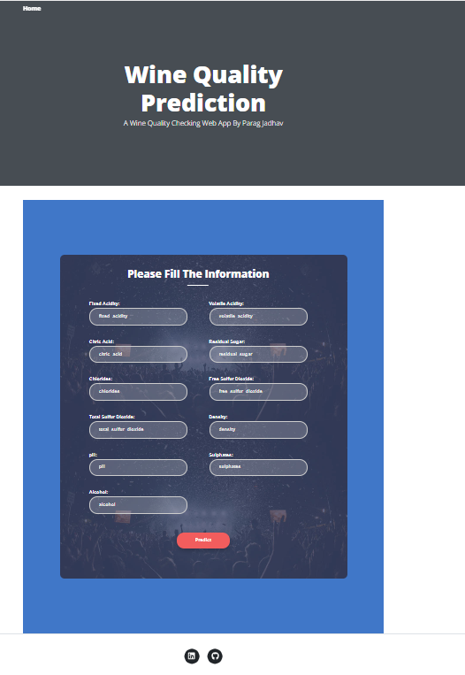
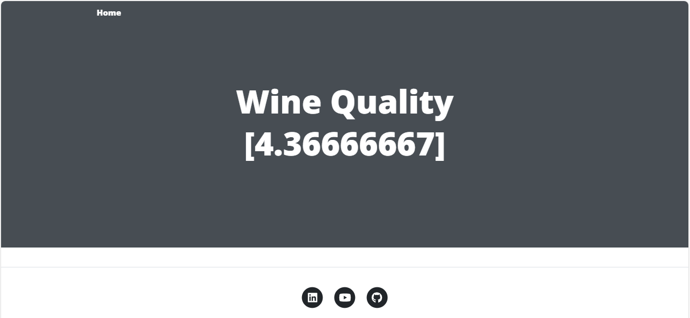

# This is end to end wine quality prediction Machine learning project.

## Technologies Used

[](https://flask.palletsprojects.com/en/1.1.x/) [](https://gunicorn.org) [](https://scikit-learn.org/stable/) 
<p>
<a></a>
<a></a>
<a></a>
<a></a>
</p>


## Problem statement

This project focuses on predicting the quality of red wine using a regression model based on various chemical properties. The dataset, sourced from Kaggle, contains multiple features that describe the characteristics of red wine samples. The primary objective is to build a model that can accurately predict the quality of wine, which is rated on a scale from 0 to 10, using these features.

## Demo




## Dataset Used
Dataset Description
The dataset consists of 12 columns, each representing a distinct attribute of the red wine samples:

**The dataset** The goal is to predict `quality` of given wine (Regression Analysis).

There are 11 independent variables:
1.  `Fixed Acidity`: The amount of non-volatile acids in the wine, mainly tartaric acid.
2. `Volatile Acidity`: The amount of acetic acid in the wine, which at high levels can lead to an unpleasant vinegar taste.
3. `Citric Acid`: A small amount of citric acid can add freshness and flavor to the wine.
4. `Residual Sugar`: The amount of sugar remaining after fermentation stops, influencing the sweetness of the wine.
5. `Chlorides`: The amount of salt in the wine.
6. `Free Sulfur Dioxide`: The free form of SO2, which acts as an antimicrobial and antioxidant.
7. `Total Sulfur Dioxide`: The total amount of SO2, which includes both free and bound forms.
8. `Density`: The density of the wine, which is closely related to the alcohol content and sugar level.
9. `pH`: Describes the acidity or alkalinity of the wine.
10. `Sulphates`: A wine additive that can contribute to the wine's sulfur dioxide levels, affecting its freshness and stability.
11. `Alcohol`: The alcohol content of the wine, contributing to its body and taste.

Target variable:

12. `Quality`: The target variable, which is the quality score assigned to the wine, ranging from 0 (very poor) to 10 (excellent).

Dataset Link :
[Dataset Link](https://www.kaggle.com/datasets/yasserh/wine-quality-dataset)


## Methodology
### Data Preprocessing:
- Handling missing values, if any.
- Scaling features to ensure uniformity and improve model performance.
- Splitting the dataset into training and testing sets to evaluate the model's performance.
### Exploratory Data Analysis (EDA):

- Analyzing the distribution of each feature.
- Investigating correlations between features and the target variable.
- Visualizing relationships through scatter plots, histograms, and heatmaps.
### Model Selection:

- Experimenting with various regression algorithms such as Linear Regression, Decision Tree Regression, Random Forest Regression, and Gradient Boosting Regression.
- Using cross-validation techniques to fine-tune hyperparameters and prevent overfitting.
### Model Evaluation:

- Assessing model performance using metrics such as Mean Squared Error (MSE), Root Mean Squared Error (RMSE), and R-squared (R²) score.
- Comparing the performance of different models to select the best one for predicting wine quality.
### Model Deployment:

- Finalizing the best model.
- Implementing the model in a production environment where it can be used to predict the quality of new wine samples based on their chemical properties.


## After finalizing the model, Industry standard object oriented programming approach for the project 

1. Data Ingestion : 
    * In Data Ingestion phase the data is first read as csv. 
    * Then the data is split into training and testing and saved as csv file.

2. Data Transformation : 
    * In this phase a ColumnTransformer Pipeline is created.
    * for Numerical Variables first SimpleImputer is applied with strategy median , then Standard Scaling is performed on numeric data.
    * for Categorical Variables: There were no categorical variables.
    * This preprocessor is saved as pickle file.

3. Model Training : 
    * In this phase base model is tested. The best model found was DecisionTreeRegressor.
    * After this hyperparameter tuning is performed on DecisionTreeRegressor and multiple model to get the best training r2 score.
    * A final DecisionTreeRegressor is selected.
    * This model is saved as pickle file.

4. Prediction Pipeline : 
    * This pipeline converts given data into dataframe and has various functions to load pickle files and predict the final results in python.

5. Flask App creation : 
    * Flask app is created with User Interface to predict the gemstone prices inside a Web Application.
6. Dockerization of the app :   
    * Dockerized the entire application using Docker tool and uploaded the docker image on Docker hub repository.
7. Deployment of the app :  
    * A Web Application is delpoyed on the AWS EC2 Instance.
8. CI/CD using GitHub Action:  
    * CI/CD pipeline is deployed using GitHub Action on the AWS EC2 Instance.

## Exploratory Data Analysis Notebook

Link : [EDA Notebook](./research/EDA.ipynb) 

# Model Training Approach Notebook

Link : [Model Training Notebook](./research/model_training_experiment.ipynb)

## Workflow

1. Update the config.yaml  
2. update the schema.yaml 
3. update the params.yaml 
4. update the entity 
5. update the configuration manager in src config
6. update the components
7. update the pipeline 
8. update the main.py
9. update the app.py file


## How to run?

### Option 1:
#### STEPS:

1. Create a virtual environment for this application.
```bash
conda create -p venv python=3.10 -y
```

2. Activate the virtual environment.
```bash
conda activate venv/
```

3. Clone this GitHub Repository.
```bash
git clone https://github.com/paragj30/red_wine_quality_prediction.git
```

4. Enter inside the red_wine_quality_prediction folder.
```bash
cd \folder_location
```

4. Install all the libraries and dependencies present in the "requirements.txt" file.
```bash
pip install -r "requirements.txt"
```

5. Run the application.
```bash
python app.py
```

6. Open the web browser and copy past the link below:
```bash
127.0.0.1:8080
```


### Option 2:
#### STEPS:

1. Open the Docker Desktop

2. Download the docker image:
```bash
docker pull paragj30/wine-quality-prediction-app:latest
```

3. Run the docker image command:
```bash
docker run -d -p 8080:8080 paragj30/wine-quality-prediction-app
```

4. Open the web browser and copy past the link below:
```bash
127.0.0.1:8080
```


## HTML and CSS Template example:
1. https://getbootstrap.com/docs/4.0/components/forms/
2. https://colorlib.com/wp/themes/unapp/


## Description: About the deployment

1. Build docker image of the source code

2. Push your docker image to Elastic Container Registry (ECR) 

3. Launch Your EC2 Instance

4. Pull the image from ECR in EC2 Instance

5. Lauch your docker image in EC2 Instance


## AWS-CICD-Deployment-with-Github-Actions

### 0. Create the Dockerfile and CICD.yaml file

### 1. Login to AWS console.

### 2. Create IAM user for deployment

Policy for Identity Access Management (IAM) User with specific access:

    1. AmazonEC2ContainerRegistryFullAccess
ECR Access: Elastic Container registry to save your docker image in AWS.

    2. AmazonEC2FullAccess
EC2 access : It is virtual machine.


### 2. Create and download the Access key and Secret access key to authenticate the GitHub Action with AWS account.

    1. AWS_ACCESS_KEY_ID

    2. AWS_SECRET_ACCESS_KEY


### 3. Create ECR repository to store/save docker image

1. AWS_ECR_LOGIN_URI: Save the URI of our docker repository. This repository will be accessible to GitHub Action through this URI.

2. ECR_REPOSITORY_NAME: Save the name of the docker repository.


### 4. Create EC2 Virtual Machine (Ubuntu) 

1. Select the "Ubuntu" OS Image as it is a lightweight virtual machine compared to the Windows VM.

2. Select the Ubuntu Server LTS (free tier) with 64-bit architecture. 

3. Select the Instance Type (Configurations of the Ubuntu VM Server) RAM, CPU and memory

4. Generate the Key pair (.pem file) to securly connect to the EC2 Instance via PuttyGen/Mobaxtrem.

5. Create a Security group by selecting the SSH, HTTP and HTTPS traffic from the internet. This group is a firewall that controls the traffic of the EC2 Instance.

    5.1 Edit the Indbound rules to  run the application. Select the "Custom TCP" and add the port number (8080).

6. Launch the EC2 Instance.

7. Connect to EC2 Instance using EC2 Instance Connect(launch terminal on tab) or SSH Client(3rd party client like PuttyGen/Mobaxtrem).
 
 

### 5. Open EC2 and Install docker in EC2 Machine:

check if any external packages are installed or not

    ls 

    clear 
To update the all package manager and dependencies in VM Instane

	sudo apt-get update -y 

	sudo apt-get upgrade 

    clear
	
** Required

To check if docker is installed or not

    docker --version 

To download the docker in the EC2 virtual machine instance

	curl -fsSL https://get.docker.com -o get-docker.sh 

To check if docker.sh file is downloaded or not. docker.sh file will have all the links and command for the docker download and installtion.

    ls 

To open and read the docker.sh file.

    cat get-docker.sh 

To run the docker.sh file. This will trigger the installation of docker.

	sudo sh get-docker.sh 

	sudo usermod -aG docker ubuntu

	newgrp docker
	
    docker --version 

To check the docker images

    docker ps  


### 6. Configure EC2 as self-hosted runner:

1. Self-hosted runner is a another VM Instance present on GitHub. So we will make a EC2 Instance as Self-hosted runner, that will make a connection with GitHub to pull the updated changes from GitHub to EC2 Instance.

    
2. github_project>Setting>Actions>Runner>New self-hosted runner> choose os> then copy, paste and run command one by one on 'EC2 Instance Connect Terminal' to make the connection with GitHub.

    
    2.1 Enter the name of runner: self-hosted
    
3. Make sure that the status of the 'self-hosted' runner is always "Idle": GitHub is connected to the EC2 Instance.


### 7. Setup github secrets:

So that GitHub can access the EC2 Instance.

github_project>Setting>Actions>Secrets and variables > Actions > New repository secret > Add the below informations:
 
    AWS_ACCESS_KEY_ID=

    AWS_SECRET_ACCESS_KEY=

    AWS_REGION = us-east-1

    AWS_ECR_LOGIN_URI = paste the URI of the Docker repository present inside the ECR.

    ECR_REPOSITORY_NAME = simple-app


### 8. Setup .github/workflows directory inside the GitHub repository:

1. By default GitHub Actions will search the '.github/workflows' directory.

2. Create the CICD.yaml and define workflow in that file.


### 9. Open the Public URL of the Application

1. Open EC2 Instance and copy the Pubic IPv4 address and paste it in the browser URL:8080

2. Successfully deployed the application.


### 10. Change the URL.

- Buy the desried domain and change the URL to the new domain.